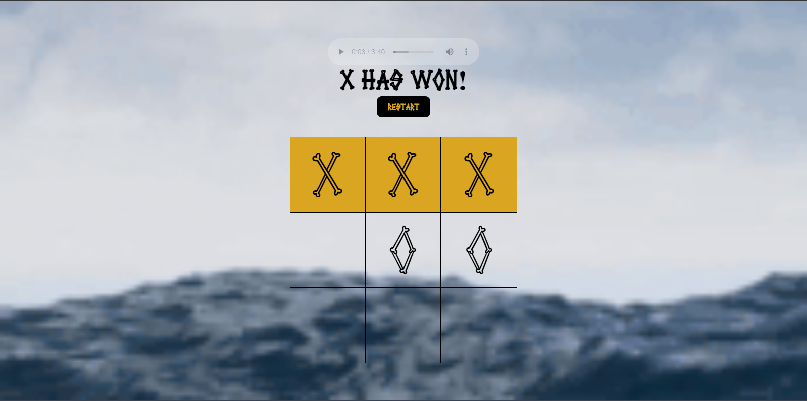
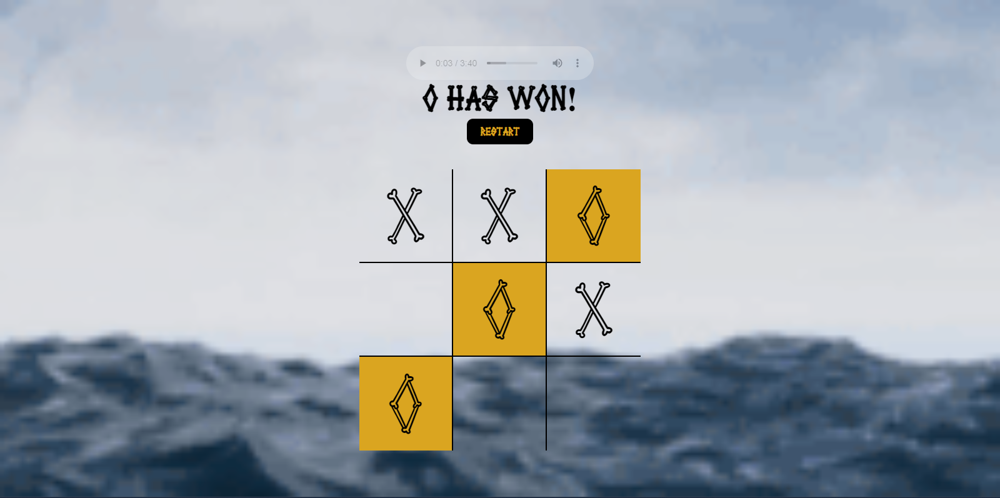
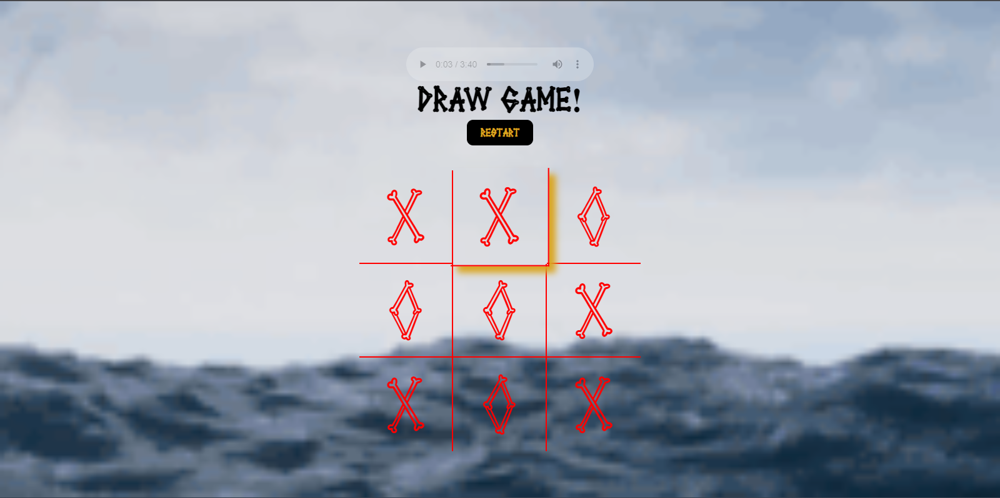

# Crossbones and Treasure chests

Hey, this is a simple tic tac toe game with a little razzle dazzle of style and music. Still a WIP to put images to the board instead of the text O and X.

- - - 

## Introduction

For anyone who doesn't know tic tac toe, you and another player choose who is X or O or in this game "CrossBones" or "Treasure Chest" and you place them on the board of 9 squares or boxes. First one to get 3 in a row win or draw if no one gets 3 in a row. The music being played is my own mix from the groovepad app on mobile phone [Game Motivation] https://en.wikipedia.org/wiki/Tic-tac-toe  and 
[Live Site]

- - - 

## Game Play

One player is X (Crossbones) and the other is O (treasure chests) you pick where you want to place your crossbones or chests until one player wins or there is a draw by filling all the squares with no one getting 3 in a row.
- - - 

## Rules:

rules are self-explanantory since this is a simple 3 in a row game. Try to get 3 in a row in any way (diagonal, horizontal, or vertical) without the other player blocking you.

- - -

## Game Play screenshots

Below is the crossbones player winning

Below is the treasure chests player winning

Below is a draw

- - - 

## Technologies used:
- HTML
- CSS
- JavaScript
- Deployed to Github pages directly from GitHub
- groovepad app on mobile phone for mix song

- - - 

## Acknowledgements:
- Youtube tutorials
- GitHub Docs
- Long Hoang
- Arianna Bunn 
- Cody Jennings and his professional readme example
- Other projects failed to get to this project lol

## How to access this Repository

1. Clone or fork the repository

To download the code, copy and paste the following into your terminal:
git clone 

2. Using VSCode launch the index.html file with the live server extension, this can be accomplished three ways. 

First is to right click on the index.html file and selecting Open with Live Server.

Second method is to use the shortcut Alt+L Alt+O

Third method is using the Go Live option in the bottom right hand corner of your terminal.

## Resources

- https://www.markdownguide.org/cheat-sheet/
- groovepad app mobile phone for mix I made 
- Youtube tutorials
- GitHub Docs
